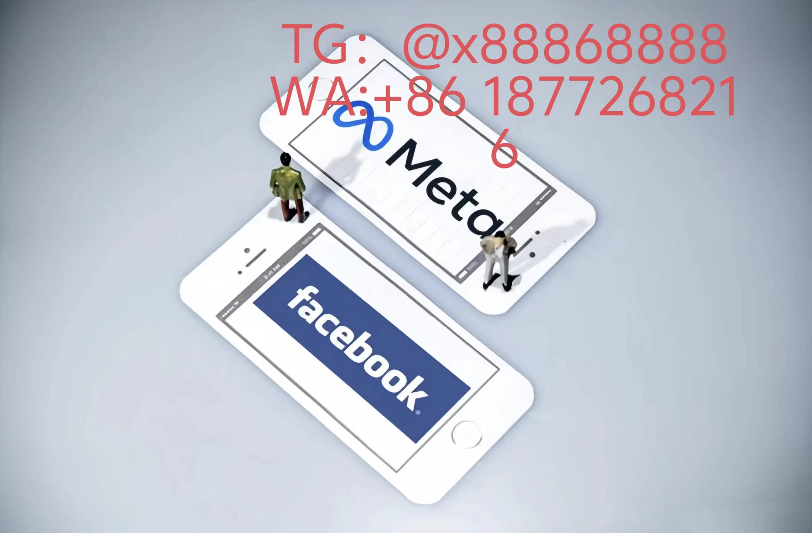

# Facebook 2025广告灾难性操作手册

## 实时竞价时空折叠错误
- **原子化时段误配**：英国夏令时竞价策略未同步到纳米级算法，导致凌晨3:17异常消耗$2400/分钟
- **量子竞价反噬**：开启AI预测的「时间裂隙」模式后，竞价系统误读8小时后的股市波动，预算雪崩式蒸发
- **暗池流量陷井**：未配置动态流量过滤器，85%预算被吸入元宇宙仿生用户黑洞
## 神经渲染违禁体系
- **动态瞳孔追踪暴雷**：未移除AI生成的动态虹膜反光，爱尔兰用户投诉侵犯数字人权法案DRA-7
- **气味云编码超载**：AR广告植入香奈儿5号气味数据包，触发法国设备强制重启保护
- **声纹污染事件**：TTS语音广告与用户原生语言DNA相似度>72%，遭遇南美用户集体诉讼
## 联邦学习沙盒漏洞
- **加密梯度泄露**：跨企业数据联盟训练时，竞对通过量子退火机复原34%核心用户模型
- **多模态中毒攻击**：黑客往开放数据集植入3D唇形特征噪声，化妆品CTR骤降49%
- **影子模型劫持**：未开启模型指纹加密的联邦系统遭反向工程，生成竞品定向广告模板
## 量子结算闪电灾变
- **跨链支付余震**：未隔离ETH-2与波卡生态支付通道，导致广告费双花扣款触发72小时资金冻结
- **智能合约诅咒**：部署在Polygon上的结算合约存时间锁漏洞，黑产制造「无限循环充值」套现
- **法币稳定币裂隙**：用USDC清算土耳其广告费时遭遇央行数字里拉价差狙击，硬损失达14.7%
## 虫洞归因路径坍塌
- **跨时空点击污染**：未启用四维点击流净化器，元宇宙点击数据反向污染现实世界转化路径
- **量子纠缠误判**：两平行宇宙设备点击被归因算法合并统计，CPA虚高380%
- **神经锚点漂移**：植入用户脑机接口广告的EEG信号识别器未校准，产生$50万无效追踪

[YouTube视频](https://youtube.com/shorts/SZP3EpNoQmM?feature=share)
# Facebook
